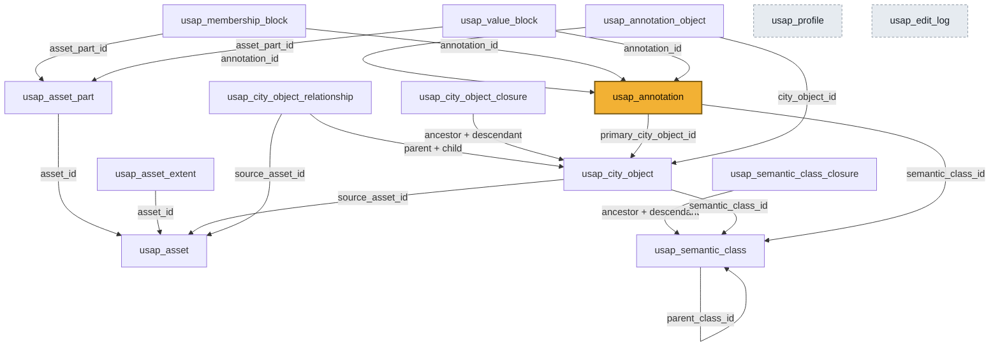
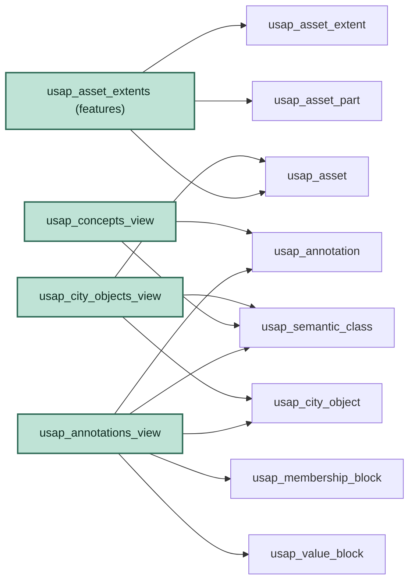
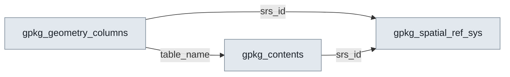

# USAP schema wiring

How the objects in [`sql/schema.sql`](../sql/schema.sql) connect: which foreign keys wire
the tables together, and which tables each view reads from.

**Object counts:** 14 USAP tables + 4 GeoPackage plumbing tables = 18 base tables,
plus 4 views and 6 indexes.

In every diagram, an arrow `A ──▶ B` means **"A has a foreign key pointing to B"**
(A references B; the arrow points at the thing being referenced).

---

## 1. The USAP data model — how the tables wire together

**The shape to notice:** `usap_annotation` (highlighted) is the hub of the whole model.
It reaches "up" to *what* something means (`usap_semantic_class`) and *which object* it
is about (`usap_city_object`), and everything below it (`_object`, `_membership_block`,
`_value_block`) reaches "down" to pin the annotation onto concrete geometry
(`usap_asset_part`). The two `_closure` tables are precomputed shortcuts hanging off
their respective hierarchies (classes, objects). `usap_profile` and `usap_edit_log`
(dashed) stand alone — no foreign keys in or out.

### Foreign keys, table by table

| Child table | Column | ──▶ References |
|-------------|--------|---------------|
| `usap_asset_part` | `asset_id` | `usap_asset(asset_id)` |
| `usap_asset_extent` | `asset_id` | `usap_asset(asset_id)` |
| `usap_semantic_class` | `parent_class_id` | `usap_semantic_class(semantic_class_id)` (self) |
| `usap_semantic_class_closure` | `ancestor_class_id` | `usap_semantic_class(semantic_class_id)` |
| `usap_semantic_class_closure` | `descendant_class_id` | `usap_semantic_class(semantic_class_id)` |
| `usap_city_object` | `semantic_class_id` | `usap_semantic_class(semantic_class_id)` |
| `usap_city_object` | `source_asset_id` | `usap_asset(asset_id)` |
| `usap_city_object_relationship` | `parent_city_object_id` | `usap_city_object(city_object_id)` |
| `usap_city_object_relationship` | `child_city_object_id` | `usap_city_object(city_object_id)` |
| `usap_city_object_relationship` | `source_asset_id` | `usap_asset(asset_id)` |
| `usap_city_object_closure` | `ancestor_city_object_id` | `usap_city_object(city_object_id)` |
| `usap_city_object_closure` | `descendant_city_object_id` | `usap_city_object(city_object_id)` |
| `usap_annotation` | `semantic_class_id` | `usap_semantic_class(semantic_class_id)` |
| `usap_annotation` | `primary_city_object_id` | `usap_city_object(city_object_id)` |
| `usap_annotation_object` | `annotation_id` | `usap_annotation(annotation_id)` |
| `usap_annotation_object` | `city_object_id` | `usap_city_object(city_object_id)` |
| `usap_membership_block` | `annotation_id` | `usap_annotation(annotation_id)` |
| `usap_membership_block` | `asset_part_id` | `usap_asset_part(asset_part_id)` |
| `usap_value_block` | `annotation_id` | `usap_annotation(annotation_id)` |
| `usap_value_block` | `asset_part_id` | `usap_asset_part(asset_part_id)` |

`usap_profile` and `usap_edit_log` have no foreign keys.

**Primary-object invariant.** An annotation's primary city object is recorded twice:
in `usap_annotation.primary_city_object_id` and as a `represents` row in
`usap_annotation_object`. When the column is not NULL, the matching `represents` row
must exist. `create_annotation` and `update_annotation` maintain both together;
`validate_report()` reports a disagreement as `ANNOTATION_PRIMARY_OBJECT_LINK_MISSING`.
Additional `usap_annotation_object` rows (other objects, other `relation_type`s) are
free-form and are not constrained by this invariant.

---

## 2. Which tables each view reads from

The four views are read-only overlays — none stores data; each is a `JOIN` across the
tables above. Here an arrow `V ──▶ T` means **"view V SELECTs from table T"**. All four
alias their primary key to `fid` and are registered in `gpkg_contents` so QGIS/GDAL can
browse them.

Each view flattens a little "star" of tables into one browsable layer for GIS tools.
`usap_asset_extents` is the only **features** (mappable) layer because it is the only
view with a geometry column; the other three are **attributes** (non-spatial) layers.

---

## 3. The GeoPackage plumbing (separate, standard, not USAP data)

These four are required by the GeoPackage spec, not invented by USAP. They wire only to
each other — the catalog machinery that lets generic GIS tools discover the layers.

`gpkg_contents` is the bridge between the two worlds: the USAP views get listed *in*
`gpkg_contents` (the "register this layer" insert in
[`src/usap/geopackage.py`](../src/usap/geopackage.py)), which is how the standard
plumbing comes to point at the USAP model. (`gpkg_extensions`, the fourth plumbing table,
has no foreign keys — USAP registers itself there so tools know the file carries USAP
tables.)

---

## 4. Indexes (neither tables nor views)

Fast-lookup structures on non-primary-key columns:

| Index | On table | Column(s) |
|-------|----------|-----------|
| `usap_scc_by_descendant` | `usap_semantic_class_closure` | `descendant_class_id` |
| `usap_rel_by_parent_graph` | `usap_city_object_relationship` | `graph_name, parent_city_object_id, relationship_type` |
| `usap_rel_by_child_graph` | `usap_city_object_relationship` | `graph_name, child_city_object_id, relationship_type` |
| `usap_annotation_by_class` | `usap_annotation` | `semantic_class_id` |
| `usap_mb_by_element_block` | `usap_membership_block` | `asset_part_id, element_kind, block_start` |
| `usap_vb_by_part` | `usap_value_block` | `asset_part_id, element_kind` |
