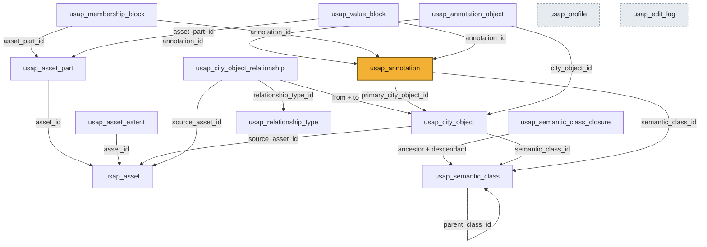
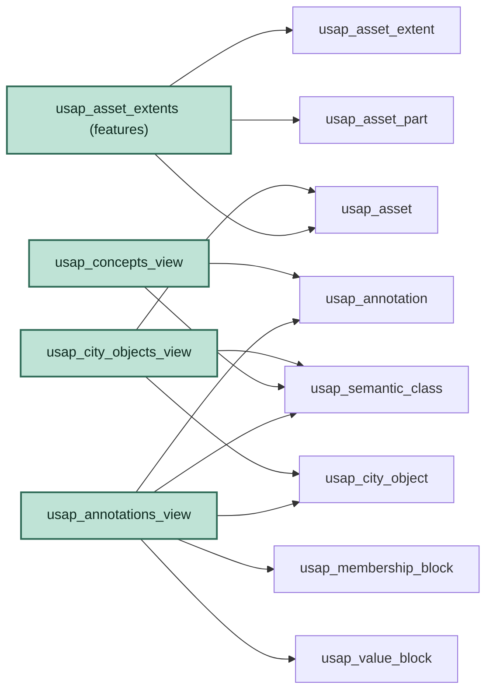
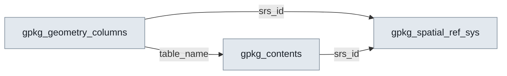

# USAP schema wiring

How the objects in [`src/usap/data/schema.sql`](../src/usap/data/schema.sql) connect: which foreign keys wire the tables together, and which tables each view reads from.

**Object counts:** 14 USAP tables + 4 GeoPackage plumbing tables = 18 base tables, plus 4 views and 9 indexes.

In every diagram, an arrow `A ──▶ B` means **"A has a foreign key pointing to B"** (A references B; the arrow points at the thing being referenced).

---
## 1. The USAP data model — how the tables wire together

**The shape to notice:** `usap_annotation` (highlighted) is the hub of the claim model. It points "up" to the registered concept (`usap_semantic_class`) and, when present, to the authoritative city-object instance the claim represents or concerns (`usap_city_object`). `usap_annotation_object` adds further authority-side object links. Separately, `usap_membership_block` and `usap_value_block` point "down" to indexed parts of operational 3D assets (`usap_asset_part`).

This distinction is important: a city-object link identifies the semantic referent of a claim, whereas a membership or value block identifies concrete points, faces, or other indexed elements in a registered geometry asset. The schema connects the two through the annotation without treating the city object itself as another geometry membership.

`usap_semantic_class_closure` is a precomputed shortcut hanging off the class hierarchy; the object graph has no such table — "an object and its parts" is walked from `usap_city_object_relationship` with a recursive CTE, because those edges are typed and edited one at a time (see `elements_for_city_object`).

Note the object graph is a *graph*, not a tree. `from`/`to` record the direction the source asserted an edge in, and whether that makes the target a **part** of the source is a property of the link type's `category` in `usap_relationship_type`, not of the columns. A peer link (`adjacentTo`, `predecessor`) is directed too, and is simply never followed by a containment query.

`usap_profile`, `usap_edit_log` and `usap_relationship_type` stand alone as far as outgoing keys go — the first two are dashed because nothing points at them either, whereas the relationship table points at the third.

### Foreign keys, table by table

| Child table | Column | ──▶ References |
|-------------|--------|---------------|
| `usap_asset_part` | `asset_id` | `usap_asset(asset_id)` |
| `usap_asset_extent` | `asset_id` | `usap_asset(asset_id)` |
| `usap_semantic_class` | `parent_class_id` | `usap_semantic_class(semantic_class_id)` (self) |
| `usap_semantic_class_closure` | `ancestor_class_id` | `usap_semantic_class(semantic_class_id)` |
| `usap_semantic_class_closure` | `descendant_class_id` | `usap_semantic_class(semantic_class_id)` |
| `usap_city_object` | `semantic_class_id` | `usap_semantic_class(semantic_class_id)` |
| `usap_city_object` | `source_asset_id` | `usap_asset(asset_id)` |
| `usap_city_object_relationship` | `from_city_object_id` | `usap_city_object(city_object_id)` |
| `usap_city_object_relationship` | `to_city_object_id` (nullable) | `usap_city_object(city_object_id)` |
| `usap_city_object_relationship` | `relationship_type_id` | `usap_relationship_type(relationship_type_id)` |
| `usap_city_object_relationship` | `source_asset_id` | `usap_asset(asset_id)` |
| `usap_annotation` | `semantic_class_id` | `usap_semantic_class(semantic_class_id)` |
| `usap_annotation` | `primary_city_object_id` | `usap_city_object(city_object_id)` |
| `usap_annotation_object` | `annotation_id` | `usap_annotation(annotation_id)` |
| `usap_annotation_object` | `city_object_id` | `usap_city_object(city_object_id)` |
| `usap_membership_block` | `annotation_id` | `usap_annotation(annotation_id)` |
| `usap_membership_block` | `asset_part_id` | `usap_asset_part(asset_part_id)` |
| `usap_value_block` | `annotation_id` | `usap_annotation(annotation_id)` |
| `usap_value_block` | `asset_part_id` | `usap_asset_part(asset_part_id)` |

`usap_profile`, `usap_edit_log` and `usap_relationship_type` have no foreign keys.

### Columns that carry identity and provenance

Not wiring, but the columns most easily mistaken for decoration. Each records
something that cannot be reconstructed later from the rest of the package:

| Table | Column | Records |
|-------|--------|---------|
| `usap_profile` | `package_iri` | the package's stable identity, minted at creation as a UUID URN |
| `usap_asset` | `content_hash` | canonical `algorithm:digest`; part of the `(uri, content_hash)` uniqueness key, so its spelling is load-bearing |
| `usap_asset_part` | `indexing_profile` | which convention assigned the element indices — a hash proves the bytes, not the ordering |
| `usap_semantic_class` | `source_namespace`, `concept_iri` | where a concept came from in its authority; `class_uri` stays the internal key |
| `usap_value_block` | `encoding` | payload compression, mirroring `usap_membership_block.encoding` |
| `usap_relationship_type` | `code_space` | the namespace the link property came from; with `local_name` it is the QName the source document wrote, and the only way a reader resolves a link type back to its definition |
| `usap_relationship_type` | `category` | whether the link means part-of. No CityGML artifact states this — not the XSD, not the conceptual model, not an OWL rendering — so it is asserted by whoever builds the package. NULL is a real value meaning *unclassified*, reported by `validate_report()` |
| `usap_city_object_relationship` | `to_external_uri` | an xlink target outside the package. The link is a genuine typed statement even though its target is not here; dropping it is how an xlink-serialized CityGML file used to import as unrelated roots |
| `usap_city_object_relationship` | `role` | `grp:Role.role`, the only role qualifier in CityGML 3.0. Never derived from the target's class, which would only restate `usap_city_object.semantic_class_id` |

**Primary-object invariant.** An annotation's primary city object is recorded twice: in `usap_annotation.primary_city_object_id` and as a `represents` row in `usap_annotation_object`. When the column is not NULL, the matching `represents` row must exist. `create_annotation` and `update_annotation` maintain both together; `validate_report()` reports a disagreement as `ANNOTATION_PRIMARY_OBJECT_LINK_MISSING`. Additional `usap_annotation_object` rows (other objects, other `relation_type`s) are free-form and are not constrained by this invariant.

---
## 2. Which tables each view reads from

The four views are read-only overlays — none stores data; each is a `JOIN` across the tables above. Here an arrow `V ──▶ T` means **"view V SELECTs from table T"**. All four alias their primary key to **`OGC_FID`** and are registered in `gpkg_contents` so QGIS/GDAL can browse them. Not `fid`: SQLite views have no rowid, and `OGC_FID` is the alias GDAL's GeoPackage driver documents for a view's feature id — a column merely *called* `fid` is carried as an ordinary attribute and GDAL substitutes its own row numbers instead of USAP ids.

Each view flattens a little "star" of tables into one browsable layer for GIS tools. `usap_asset_extents` is the only **features** (mappable) layer because it is the only view with a geometry column; the other three are **attributes** (non-spatial) layers.

---
## 3. The GeoPackage plumbing (separate, standard, not USAP data)

These four are required by the GeoPackage spec, not invented by USAP. They wire only to each other — the catalog machinery that lets generic GIS tools discover the layers.

`gpkg_contents` is the bridge between the two worlds: the USAP views get listed *in* `gpkg_contents` (the "register this layer" insert in [`src/usap/geopackage.py`](../src/usap/geopackage.py)), which is how the standard plumbing comes to point at the USAP model. (`gpkg_extensions`, the fourth plumbing table, has no foreign keys — USAP registers itself there so tools know the file carries USAP tables.)

---
## 4. Indexes (neither tables nor views)

Fast-lookup structures on non-primary-key columns:

| Index | On table | Column(s) |
|-------|----------|-----------|
| `usap_scc_by_descendant` | `usap_semantic_class_closure` | `descendant_class_id` |
| `usap_rel_by_from_graph` | `usap_city_object_relationship` | `graph_name, from_city_object_id, relationship_type_id` |
| `usap_rel_by_to_graph` | `usap_city_object_relationship` | `graph_name, to_city_object_id, relationship_type_id` |
| `usap_rel_unresolved` | `usap_city_object_relationship` | `to_external_uri` **(partial:** `WHERE to_external_uri IS NOT NULL`**)** |
| `usap_relationship_type_identity` | `usap_relationship_type` | `local_name, COALESCE(code_space, '')` **(unique, expression)** |
| `usap_relationship_type_by_category` | `usap_relationship_type` | `category` |
| `usap_annotation_by_class` | `usap_annotation` | `semantic_class_id` |
| `usap_mb_by_element_block` | `usap_membership_block` | `asset_part_id, element_kind, block_start` |
| `usap_vb_by_part` | `usap_value_block` | `asset_part_id, element_kind` |
